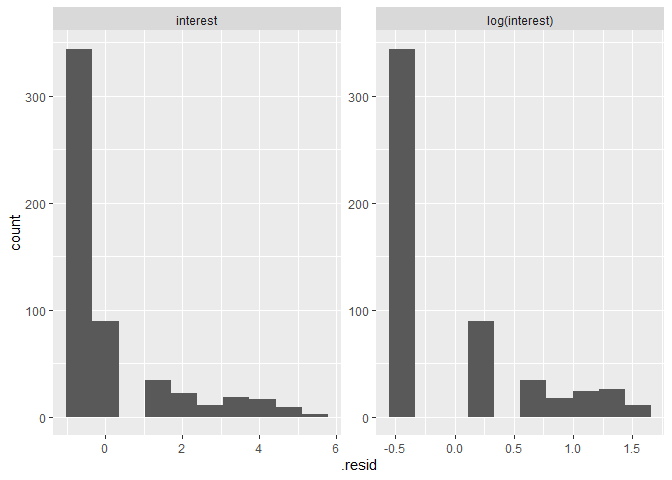
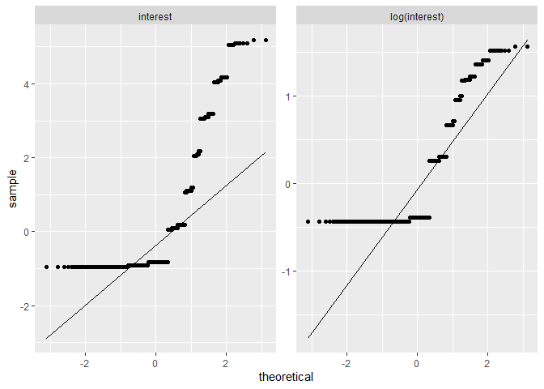

MLM Disclosure Experiment- Analysis Document
================
Austin Miller
8/4/2022

-   <a href="#introduction" id="toc-introduction">Introduction</a>
-   <a href="#load-packages" id="toc-load-packages">Load Packages</a>
-   <a href="#read-data" id="toc-read-data">Read Data</a>
-   <a href="#income-disclosure-effects-on-all-dependent-variables"
    id="toc-income-disclosure-effects-on-all-dependent-variables">Income
    Disclosure Effects on All Dependent Variables</a>
    -   <a href="#fit-the-models" id="toc-fit-the-models">Fit the models</a>
    -   <a href="#estimate-robust-standard-errors"
        id="toc-estimate-robust-standard-errors">Estimate Robust Standard
        Errors</a>
    -   <a href="#format-output" id="toc-format-output">Format Output</a>
-   <a href="#justification-for-logarithmic-transforms"
    id="toc-justification-for-logarithmic-transforms">Justification for
    Logarithmic Transforms</a>
-   <a href="#alternative-interest-specifications"
    id="toc-alternative-interest-specifications">Alternative Interest
    Specifications</a>
    -   <a href="#ordered-logit" id="toc-ordered-logit">Ordered Logit</a>
    -   <a href="#interest-greater-than-1"
        id="toc-interest-greater-than-1">Interest Greater Than 1</a>
-   <a href="#heterogeneous-treatment-effects"
    id="toc-heterogeneous-treatment-effects">Heterogeneous Treatment
    Effects</a>
-   <a href="#thinking-about-earnings-on-interest"
    id="toc-thinking-about-earnings-on-interest">Thinking About Earnings on
    Interest</a>
    -   <a href="#correlation-of-interest-and-earnings"
        id="toc-correlation-of-interest-and-earnings">Correlation of Interest
        and Earnings</a>
    -   <a href="#order-effects" id="toc-order-effects">Order Effects</a>

# Introduction

This document presents the R script that I wrote to analyze the data
generated by a recent Amazon Mechanical Turk survey experiment. The goal
of the analysis is to assess the impact of voluntary income disclosures
in MLM marketing materials on consumer interest and earnings
expectations. All participants were introduced to an MLM opportunity
using marketing materials from the website of an actual MLM firm. The
control group did not receive any income disclosure information;
treatment group 1 received the income disclosure document created by the
MLM firm itself; and treatment group 2 received an augmented form of the
firm’s income disclosure information that included a graph and presented
how many participants in the firm actually earned zero dollars. The
analysis from this experiment was recently published in the Journal of
Consumer Affairs.

# Load Packages

``` r
library(tidyverse)
library(stringr)
library(modelr)
library(broom)
library(lmtest)
library(sandwich)
library(stargazer)
library(shiny)
```

I don’t know if this script actually uses each of these packages; many
of them are just included in most of my R scripts by default.

# Read Data

``` r
mlm <- readRDS("mlm_2022_clean.rds")
```

This line reads in the data created by the `MLMExperiment_data.Rmd`
document.

``` r
dependents <- c("interest","earnings","earnleast","earnmost","over6","expenses")
controls <- c("woman","age","education","income","black","white","hispanic","relig","earnbta",
              "numeracy","finance","EVtest","risk","knownMLM","wasMLM")
```

The first thing I do is create some groups of variables so I can work
with a group at a time rather than listing all variables every time. The
full `mlm` data frame actually contains 190 variables, but most of those
are the raw variables from Qualtrics and are not used. I keep them
around in the principle of non-destructive editing, I suppose. If I
decide that I want to create a new variable or re-transform something,
etc. (which I do a lot over the course of a project), then I don’t have
to go back and look for stuff in the original raw data or change the
line of code that keeps only “important” variables.

# Income Disclosure Effects on All Dependent Variables

These models represent the main analysis of the paper. I regress each
dependent variable on whether a person was exposed to either treatment.

Most of my linear regression analyses follow three steps:

1.  fit the model
2.  estimate robust standard errors
3.  display results in a clean table

## Fit the models

``` r
m_interest_c  <- lm(linterest ~ ., data = mlm %>% 
                                      select(linterest, treatment, all_of(controls)))
m_interest_t2 <- lm(linterest ~ ., data = mlm %>% 
                                      filter(treatment != "No Disclosure") %>%
                                      select(linterest, treatment, all_of(controls)))

m_earnings_c <- lm(learnings ~ ., data = mlm %>% 
                                      select(learnings, treatment, all_of(controls)))
m_earnings_t2 <- lm(learnings ~ ., data = mlm %>% 
                                      filter(treatment != "No Disclosure") %>%
                                      select(learnings, treatment, all_of(controls)))

m_earnmost_c <- lm(learnmost ~ ., data = mlm %>% 
                                      select(learnmost, treatment, all_of(controls)))
m_earnmost_t2 <- lm(learnmost ~ ., data = mlm %>% 
                                      filter(treatment != "No Disclosure") %>%
                                      select(learnmost, treatment, all_of(controls)))

m_earnleast_c <- lm(learnleast ~ ., data = mlm %>% 
                                      select(learnleast, treatment, all_of(controls)))
m_earnleast_t2 <- lm(learnleast ~ ., data = mlm %>% 
                                      filter(treatment != "No Disclosure") %>%
                                      select(learnleast, treatment, all_of(controls)))

m_over6_c <- lm(lover6 ~ ., data = mlm %>% 
                                      select(lover6, treatment, all_of(controls)))
m_over6_t2 <- lm(lover6 ~ ., data = mlm %>% 
                                      filter(treatment != "No Disclosure") %>%
                                      select(lover6, treatment, all_of(controls)))

m_expenses_c <- lm(lexpenses ~ ., data = mlm %>% 
                                      select(lexpenses, treatment, all_of(controls)))
m_expenses_t2 <- lm(lexpenses ~ ., data = mlm %>% 
                                      filter(treatment != "No Disclosure") %>%
                                      select(lexpenses, treatment, all_of(controls)))
```

Here I fit two `lm()` models for each dependent variable: `m_*_c`
includes all the data and estimates whether the intent-to-treat effect
of either treatment is likely different from zero, and `m_*_t2` excludes
observations from the control group (`"No Disclosure"`) to estimate
whether the observed effect of treatment 2 is likely different from the
average effect of treatment 1. All models use the logarithm of the
dependent variable and include all of the control variables.

## Estimate Robust Standard Errors

``` r
ses_c <- list()
ses_c   <- append(ses_c, list(sqrt(diag(vcovHC(m_interest_c, type = "HC1")))))
ses_c   <- append(ses_c, list(sqrt(diag(vcovHC(m_earnings_c, type = "HC1")))))
ses_c   <- append(ses_c, list(sqrt(diag(vcovHC(m_earnmost_c, type = "HC1")))))
ses_c   <- append(ses_c, list(sqrt(diag(vcovHC(m_earnleast_c, type = "HC1")))))
ses_c   <- append(ses_c, list(sqrt(diag(vcovHC(m_over6_c, type = "HC1")))))
ses_c   <- append(ses_c, list(sqrt(diag(vcovHC(m_expenses_c, type = "HC1")))))

ses_t2 <- list()
ses_t2   <- append(ses_c, list(sqrt(diag(vcovHC(m_interest_t2, type = "HC1")))))
ses_t2   <- append(ses_c, list(sqrt(diag(vcovHC(m_earnings_t2, type = "HC1")))))
ses_t2   <- append(ses_c, list(sqrt(diag(vcovHC(m_earnmost_t2, type = "HC1")))))
ses_t2   <- append(ses_c, list(sqrt(diag(vcovHC(m_earnleast_t2, type = "HC1")))))
ses_t2   <- append(ses_c, list(sqrt(diag(vcovHC(m_over6_t2, type = "HC1")))))
ses_t2   <- append(ses_c, list(sqrt(diag(vcovHC(m_expenses_t2, type = "HC1")))))
```

Here I create lists of all the standard errors for the coefficients in
each regression model (two lists of six models each). In each case, I
start with the `vcovHC()` function from `sandwich`, which estimates a
heteroscedasticity-consistent variance-covariance matrix for the given
model. `"HC1"` denotes [MacKinnon & White
(1985)](https://doi.org/10.1016/0304-4076(85)90158-7)’s method, which
adjusts for degrees of freedom. I then isolate the variances from the
matrix, which are in the diagonal `diag()`, and take the square root
`sqrt()` to turn these variances into standard deviations. The result is
a list of standard errors for each model, which I append into two lists
of six lists.

## Format Output

``` r
stargazer(m_interest_c, m_earnings_c, m_earnmost_c, m_earnleast_c, m_over6_c, m_expenses_c,
          se = ses_c,
          #apply.coef = exp,
          keep = c("Company Disclosure", "Graphical Disclosure"),
          header=FALSE,
          model.numbers = FALSE,
          dep.var.labels = c("Interest", "Typical" , "Most", "Least", "Over", "Expenses"),
          column.labels = c("", "Earnings" ,"Earnings", "Earnings", "6,000", ""),
          covariate.labels = c("Company Disclosure", "Graphical Disclosure"),
          digits = 2,
          digits.extra = 1,
          omit.stat = c("f","rsq","ser"),
          report= c("vc*sp"),
          #report= c("vc"),
          notes.align = "l",
          type = "text")
```

    ## 
    ## ============================================================================
    ##                                        Dependent variable:                  
    ##                      -------------------------------------------------------
    ##                      Interest  Typical    Most     Least     Over   Expenses
    ##                               Earnings  Earnings Earnings   6,000           
    ## ----------------------------------------------------------------------------
    ## Company Disclosure    -0.04    -0.54**   -0.03     0.19    -0.05**   -0.18  
    ##                       (0.06)   (0.25)    (0.28)   (0.32)    (0.02)   (0.16) 
    ##                      p = 0.53 p = 0.03  p = 0.92 p = 0.56  p = 0.02 p = 0.27
    ##                                                                             
    ## Graphical Disclosure  -0.08   -1.60***  -0.71**  -1.70***  -0.11***  -0.22  
    ##                       (0.06)   (0.30)    (0.29)   (0.35)    (0.02)   (0.18) 
    ##                      p = 0.18 p = 0.000 p = 0.02 p = 0.000 p = 0.00 p = 0.23
    ##                                                                             
    ## ----------------------------------------------------------------------------
    ## Observations           545       545      545       545      545      381   
    ## Adjusted R2            0.18     0.16      0.06     0.18      0.25     0.02  
    ## ============================================================================
    ## Note:                *p<0.1; **p<0.05; ***p<0.01

The last step is to combine the models with the robust standard errors
to include hypothesis tests for each variable of interest. `stargazer()`
will calculate p-values from the supplied list of standard errors and
display asterisks in the table accordingly. I also monkey with the
settings of `stargazer()` to format the table in a way that I like. I
only keep the coefficients on each treatment, choosing not to display
here the coefficients on the control variables. I change the labels on
columns and rows, adjust the digits displayed after the decimal, and
choose which statistics to include and exclude in the table. `"vc*sp"`
indicates the inclusion of the variable name `v`, the estimated slope
coefficient `c`, a number of asterisks `*` related to the size of the
p-value, the robust standard error supplied `s`, and the calculated
p-value `p` for each variable displayed.

This first table displays the estimated intention-to-treat effects of
both treatments on each of the six dependent variables. The first row
contains the estimated effects of the company-produced disclosure; the
second row shows those of the graphical disclosure. Generally, we find
no significant effect of income disclosure on subjects’ interest in the
MLM opportunity, on average. Both treatments have a significant effect
on estimated Typical Earnings, and on the estimated likelihood of
earning over $6,000 in a year. Only the graphical disclosure has a
significant effect on the average Most Earnings and Least Earnings.
Finally, as expected, we observe no meaningful difference in the
estimates of expenses between disclosure groups.

Because of the logarithmic transformation, when the values of these
coefficients are relatively small, they can be interpreted as percentage
changes in the dependent variable due to treatment. For larger values,
it is more accurate to exponentiate the coefficients `exp()` before
interpretation. The exponentiated coefficients are then interpreted as
the ratio of the geometric means of the dependent variable between the
corresponding treatment group and the control group.

``` r
stargazer(m_interest_c, m_earnings_c, m_earnmost_c, m_earnleast_c, m_over6_c, m_expenses_c,
          #se = ses_c,
          apply.coef = exp,
          keep = c("Company Disclosure", "Graphical Disclosure"),
          header=FALSE,
          model.numbers = FALSE,
          dep.var.labels = c("Interest", "Typical" , "Most", "Least", "Over", "Expenses"),
          column.labels = c("", "Earnings" ,"Earnings", "Earnings", "6,000", ""),
          covariate.labels = c("Company Disclosure", "Graphical Disclosure"),
          digits = 2,
          digits.extra = 1,
          omit.stat = c("f","rsq","ser"),
          #report= c("vc*sp"),
          report= c("vc"),
          notes.align = "l",
          type = "text")
```

    ## 
    ## =======================================================================
    ##                                     Dependent variable:                
    ##                      --------------------------------------------------
    ##                      Interest Typical    Most    Least   Over  Expenses
    ##                               Earnings Earnings Earnings 6,000         
    ## -----------------------------------------------------------------------
    ## Company Disclosure     0.96     0.58     0.97     1.21   0.96    0.83  
    ##                                                                        
    ## Graphical Disclosure   0.92     0.20     0.49     0.18   0.90    0.81  
    ##                                                                        
    ## -----------------------------------------------------------------------
    ## Observations           545      545      545      545     545    381   
    ## Adjusted R2            0.18     0.16     0.06     0.18   0.25    0.02  
    ## =======================================================================
    ## Note:                *p<0.1; **p<0.05; ***p<0.01

I add the option `apply.coef = exp` to display exponentiated
coefficients, but I remove `*sp` from the report because these values
will not correspond to the exponentiated values.

The company disclosure results in estimated earnings that are about 58
percent of the earnings reported by those in the control group, and the
graphical disclosure results in estimated earnings that are about 20
percent of those reported in the control group. The graphical disclosure
reduces both Most Earnings by half and Least Earnings by 82 percent (1 -
0.18 = 0.82). We also see that the company-disclosure treatment reduces
the estimated likelihood of earning over $6,000 in a year by about 5
percent relative to no disclosure, and the graphical disclosure reduces
the likelihood by about 11 percent (essentially a one-half bin and full
bin decrease, respectively).

``` r
stargazer(m_interest_t2, m_earnings_t2, m_earnmost_t2, m_earnleast_t2, m_over6_t2, m_expenses_t2,
          se = ses_t2,
          keep = c("Graphical Disclosure"),
          header=FALSE,
          model.numbers = FALSE,
          dep.var.labels = c("Interest", "Typical" , "Most", "Least", "Over", "Expenses"),
          column.labels = c("", "Earnings" ,"Earnings", "Earnings", "6,000", ""),
          covariate.labels = c("Graphical Disclosure"),
          digits = 2,
          digits.extra = 1,
          omit.stat = c("f","rsq","ser"),
          report= c("vc*sp"),
          notes.align = "l",
          type = "text")
```

    ## 
    ## =============================================================================
    ##                                        Dependent variable:                   
    ##                      --------------------------------------------------------
    ##                      Interest  Typical    Most     Least     Over    Expenses
    ##                               Earnings  Earnings Earnings    6,000           
    ## -----------------------------------------------------------------------------
    ## Graphical Disclosure  -0.03   -1.03***  -0.65**  -1.80***  -0.06***   -0.03  
    ##                       (0.06)   (0.30)    (0.29)   (0.35)    (0.02)    (0.18) 
    ##                      p = 0.60 p = 0.001 p = 0.03 p = 0.000 p = 0.002 p = 0.89
    ##                                                                              
    ## -----------------------------------------------------------------------------
    ## Observations           366       366      366       366       366      248   
    ## Adjusted R2            0.18     0.17      0.06     0.17      0.24     -0.002 
    ## =============================================================================
    ## Note:                *p<0.1; **p<0.05; ***p<0.01

This table displays the results of tests for whether the estimated
treatment effects are different for the graphical-disclosure treatment
relative to the company-disclosure treatment. The difference between the
effects of these two treatments is statistically significant for Typical
Earnings, Most Earnings, Least Earnings, and the likelihood of earning
over $6,000 in a year.

# Justification for Logarithmic Transforms

one reason for transforming the dependent variables is because of their
skew. The linear regression models assume that errors are distributed
normally. The following analysis shows how the logarithmic transform
results in more normally distributed residuals in most cases.

``` r
m_interest_ <- lm(interest ~ treatment, data = mlm)
m_interest  <- lm(linterest ~ treatment, data = mlm)

interest_results <- augment(m_interest_, mlm %>% 
                                          filter(!is.na(interest))
                            ) %>%
                      mutate(model = "interest")

linterest_results <- augment(m_interest, mlm %>% 
                                          filter(!is.na(interest))
                             ) %>%
                      mutate(model = "log(interest)")

compare_interest_models <- rbind(interest_results, linterest_results) %>%
                            mutate(model = as_factor(model) %>% 
                                            fct_relevel("interest")
                                   )

ggplot(compare_interest_models) +
  geom_histogram(aes(.resid), bins = 10) +
  facet_wrap(~model, scales = "free")
```

<!-- -->

``` r
ggplot(compare_interest_models, aes(sample = .resid)) + 
  stat_qq() +
  stat_qq_line() +
  facet_wrap(~model, scales = "free")
```

<!-- -->

This section calculates residuals for two competing models: one with
original `interest` measured on a seven-point scale with the majority of
responses having a value of 1, which indicates
`"1- No Interest At All"`, and one with the logarithm of interest as the
dependent variable. Residuals also tend to be much normal–and harder to
compare–in models that include the control variables so I omit them for
now. The `augment()` function calculates predicted values and residuals
for every non-missing observation in the data. I do this for both models
and then `rbind()` the two augmented data frames together, using the
newly created variable `model` to differentiate which residuals come
from which model. Finally, I create two sets of graphs to visually
evaluate the normality of the calculated residuals. The first set of
graphs displays a histogram of the residuals for each model. The second
set of graphs displays a Q-Q plot for each model, in which each dot
represents an observation and dots closer to the superimposed line
indicate values that are more consistent with a normal distribution.

The distribution of residuals when regressing `log(interest)` on
`treatment` appears slightly more normal than the models of `interest`
on `treatment`. The following section repeats this process for each
dependent variable.


<iframe src="https://uncle-pasta.shinyapps.io/log-app/?showcase=0" width="100%" height="1100px" data-external="1">
</iframe>


You can see that generally the logarithmic transformation results in
more normal residuals.

# Alternative Interest Specifications

Because `interest` is measure on a seven-point Likert-type scale, I
present two alternative models with different assumptions that may be
more fitting than the typical linear model.

## Ordered Logit

The linear model assumes that the distance between values of `interest`
is meaningful and that the distance between any two adjacent values is
equal. The ordered logit model treats each value as a separate category
where only the order matters. The test of a coefficient in this model is
whether a one-unit increase in the independent variable results in a
change in the likelihood (log-odds) of being in a higher category? In
this case, a one-unit increase is equivalent to being in one or the
other treatment group relative to the control group.

``` r
library(MASS)
```

    ## 
    ## Attaching package: 'MASS'

    ## The following object is masked from 'package:dplyr':
    ## 
    ##     select

``` r
ol_int    <- polr(as.factor(interest) ~ treatment, data= mlm)
ol_int_c  <- polr(as.factor(interest) ~ ., data = mlm %>% 
                                                    dplyr::select(interest, treatment, all_of(controls)))

stargazer(ol_int, ol_int_c,
          keep = c("Company Disclosure", "Graphical Disclosure"),
          header=FALSE,
          model.numbers = FALSE,
          dep.var.labels = "Ordered Interest Categories",
          covariate.labels = c("Company Disclosure", "Graphical Disclosure"),
          digits = 2,
          digits.extra = 1,
          report= c("vc*sp"),
          notes.align = "l",
          add.lines = list(c("Controls", "", "X")),
          type= "text")
```

    ## 
    ## =================================================
    ##                          Dependent variable:     
    ##                      ----------------------------
    ##                      Ordered Interest Categories 
    ## -------------------------------------------------
    ## Company Disclosure       -0.16          -0.11    
    ##                          (0.21)        (0.22)    
    ##                         p = 0.45      p = 0.62   
    ##                                                  
    ## Graphical Disclosure     -0.07          -0.31    
    ##                          (0.21)        (0.23)    
    ##                         p = 0.74      p = 0.18   
    ##                                                  
    ## -------------------------------------------------
    ## Controls                                  X      
    ## Observations              545            545     
    ## =================================================
    ## Note:                *p<0.1; **p<0.05; ***p<0.01

``` r
detach("package:MASS", unload=TRUE)
```

To estimate an ordered logit model, I use `polr()` from the `MASS`
package. Because this package also has a function named `select()` that
interferes with `select()` from `dplyr`, I have to qualify which
`select()` I intend to use here. This is also why I don’t load this
package at the beginning of the script and why I unload it as soon as I
am done with it. I also estimate this model both with and without
control variables.

We continue to not observe any significant effects of income disclosure
treatment on interest in that neither treatment seems to affect the
log-odds of being in a higher category of interest.

## Interest Greater Than 1

Because most respondents report having an `interest` of
`"1- No Interest At All"`, I also estimate a model for whether treatment
affects the odds of having any interest that is greater than 1.

``` r
bin_int     <- glm(interestover1 ~ treatment
                   , data = mlm
                   , family = "binomial")

bin_int_c   <- glm(interestover1 ~ .
                   , data = mlm %>% 
                             select(interestover1, treatment, all_of(controls))
                   , family = "binomial")

stargazer(bin_int, bin_int_c,
          keep = c("Company Disclosure", "Graphical Disclosure"),
          header = FALSE,
          model.numbers = FALSE,
          dep.var.labels = "Prob(Interest >1)",
          covariate.labels = c("Company Disclosure", "Graphical Disclosure"),
          digits = 2,
          digits.extra = 1,
          report = c("vc*sp"),
          notes.align = "l",
          add.lines = list(c("Controls", "", "X")),
          type = "text")
```

    ## 
    ## =================================================
    ##                          Dependent variable:     
    ##                      ----------------------------
    ##                           Prob(Interest >1)      
    ## -------------------------------------------------
    ## Company Disclosure       -0.15          -0.13    
    ##                          (0.22)        (0.24)    
    ##                         p = 0.50      p = 0.61   
    ##                                                  
    ## Graphical Disclosure     -0.14          -0.41    
    ##                          (0.22)        (0.25)    
    ##                         p = 0.54      p = 0.11   
    ##                                                  
    ## -------------------------------------------------
    ## Controls                                  X      
    ## Observations              545            545     
    ## Log Likelihood          -358.50        -308.39   
    ## Akaike Inf. Crit.        723.00        660.78    
    ## =================================================
    ## Note:                *p<0.1; **p<0.05; ***p<0.01

This is a logistic regression model of a binary variable on treatment. I
use `glm(..., family = "binomial")` to estimate it. I also estimate this
model both with and without control variables.

Again, we do not observe any significant average effect of treatment on
interest. It seems that most people are either uninterested or
interested regardless of the income disclosure.

# Heterogeneous Treatment Effects

An income disclosure may interact with consumer characteristics, needs,
and knowledge. Different consumers may be looking for different
information, and consumer comprehension and use may vary based on
individual characteristics including specific prior knowledge or
beliefs, age, or gender. If consumers find it difficult to understand a
disclosure due to its complexity, level of detail, or the need for
prerequisite knowledge, they may not use the disclosure in judgment
formation or decision making. Alternatively, such consumers may make
faulty inferences from the disclosure. In this experiment, relevant
knowledge is represented by educational attainment, financial literacy,
numeracy, and understanding of expected value.

Additionally, the effect of the income disclosure may be affected by a
consumer’s self-perception. Individuals who perceive themselves as
better-than-average may be more likely to perceive low probability, high
earnings outcomes presented in the disclosure as achievable. For these
consumers, the disclosure of past high earners—despite their low
frequency—may elevate their personal expectations. We have observed that
disclosure significantly lowered earnings expectations on average, but
that expectations for a small subset seem to be inflated by disclosure.
This may be partially due to a better-than-average effect.

``` r
m_int   <- lm(linterest ~ treatment*numeracy, data = mlm)
m_int_c <- lm(linterest ~ treatment*numeracy + 
                woman + age + income + black + white + hispanic + 
                relig + risk + knownMLM + wasMLM, data = mlm)

m_earn    <- lm(learnings ~ treatment*numeracy, data = mlm)
m_earn_c  <- lm(learnings ~ treatment*numeracy + 
                woman + age + income + black + white + hispanic + 
                relig + risk + knownMLM + wasMLM, data = mlm)

ses_h <- list()
ses_h    <- append(ses_h, list(sqrt(diag(vcovHC(m_int, type = "HC1")))))
ses_h    <- append(ses_h, list(sqrt(diag(vcovHC(m_int_c, type = "HC1")))))
ses_h    <- append(ses_h, list(sqrt(diag(vcovHC(m_earn, type = "HC1")))))
ses_h    <- append(ses_h, list(sqrt(diag(vcovHC(m_earn_c, type = "HC1")))))

stargazer(m_int, m_int_c, m_earn, m_earn_c,
          se = ses_h,
          keep = c("Company Disclosure", "Graphical Disclosure", "numeracy"),
          header = FALSE,
          model.numbers = FALSE,
          dep.var.labels.include = FALSE,
          column.labels = c("Interest", "Interest", "Earnings", "Earnings"),
          covariate.labels = c("Treatment 1", "Treatment 2", "Numeracy",
                               "Treatment 1 x Numeracy", "Treatment 2 x Numeracy"),
          digits = 2,
          omit.stat = c("f","ser","rsq"),
          report = c("vc*sp"),
          notes.align = "l",
          add.lines = list(c("Controls", "", "X", "", "X")),
          type = "text")
```

    ## 
    ## ==========================================================
    ##                                Dependent variable:        
    ##                        -----------------------------------
    ##                        Interest Interest Earnings Earnings
    ## ----------------------------------------------------------
    ## Treatment 1             -0.08    -0.11    -0.13    -0.25  
    ##                         (0.18)   (0.18)   (0.84)   (0.82) 
    ##                        p = 0.66 p = 0.54 p = 0.88 p = 0.76
    ##                                                           
    ## Treatment 2             0.39**    0.31     0.89     0.69  
    ##                         (0.19)   (0.19)   (0.87)   (0.87) 
    ##                        p = 0.04 p = 0.11 p = 0.31 p = 0.43
    ##                                                           
    ## Numeracy                -0.03    -0.03     0.08     0.07  
    ##                         (0.05)   (0.06)   (0.26)   (0.27) 
    ##                        p = 0.57 p = 0.62 p = 0.76 p = 0.80
    ##                                                           
    ## Treatment 1 x Numeracy   0.02     0.03    -0.22    -0.14  
    ##                         (0.07)   (0.07)   (0.33)   (0.33) 
    ##                        p = 0.85 p = 0.68 p = 0.52 p = 0.68
    ##                                                           
    ## Treatment 2 x Numeracy -0.17**  -0.15**  -0.96*** -0.89** 
    ##                         (0.07)   (0.07)   (0.36)   (0.36) 
    ##                        p = 0.02 p = 0.05 p = 0.01 p = 0.02
    ##                                                           
    ## ----------------------------------------------------------
    ## Controls                           X                 X    
    ## Observations             545      545      545      545   
    ## Adjusted R2              0.02     0.09     0.05     0.08  
    ## ==========================================================
    ## Note:                  *p<0.1; **p<0.05; ***p<0.01

This model expands the basic intention-to-treat models by separating
heterogeneous treatment effects across levels of numeracy. This is
accomplished by including interactions of both treatments with numeracy
level (the individual’s `numeracy` score between zero and three). The
control variables here do not include other measures of consumer
knowledge, but I test the interaction of treatment with these other
variables individually in the next section.

The significant interaction term of `numeracy` with `Treatment 2` across
the board suggests that the graphical income disclosure decreases both
interest and expected earnings for those with non-zero `numeracy`
scores. The effect is robust to the inclusion of control variables. This
is important because we have seen that the disclosures do not have a
significant effect on interest on average. We also see that
`Treatment 2` may actually increase `interest` for those with a numeracy
score of zero; this diverging effect helps to explain why no effect is
observed in the aggregate.

The following section repeats this heterogeneous treatment effect
analysis with interaction terms for other covariates of interest.


<iframe src="https://uncle-pasta.shinyapps.io/heterogeneous_app/?showcase=0" width="100%" height="775px" data-external="1">
</iframe>


According to these models, it seems that `age` interacts with `interest`
and `treatment` in a similar way as `numeracy`. For those younger than
45, the graphical disclosure increases `interest`. For those older than
45, the effect of `treatment` on `interest` is negative. This
relationship disappears when controls are included, indicating that it
is likely the knowledge gained as people age that makes the difference.
On the other hand, the magnitude of the negative effect of income
disclosure on earnings estimations tends to decrease toward zero as age
increases, potentially turning into a positive effect for those over
about age 60. This interaction effect is robust to the inclusion of
control variables in the case of the non-graphical, company-produced
disclosure.

We mostly observe no significant interaction effects for gender,
education, or financial literacy. One exception is for those who took
some college classes but never got a degree. The effect of the
company-produced disclosure on estimated earnings is negative for most
people, but much smaller and potentially positive for those with a
little bit of college experience. The other exception is that the
treatment effect of the graphical disclosure on earnings is more
negative for those who are able to correctly answer a question about
expected value, but the statistical significance of this effect drops
off when other controls are included.

Lastly, we observe a large positive effect of a better-than-average
self-perception on both `interest` and `earnings`. When controls are
included, we also observe that this better-than-average effect reverses
the negative effect of the graphical disclosure on estimated earnings.
In other words, those who expect that they will earn more than the
average participant have even higher estimated earnings than others if
they see the graphical income disclosure.

The last set of regressions here combine the effects of `numeracy` and
`earnbta` into a single model.

``` r
m_int   <- lm(linterest ~ treatment*numeracy + treatment*earnbta4, data= mlm)
m_int_c <- lm(linterest ~ treatment*numeracy + treatment*earnbta4 + 
                woman + age + income + black + white + hispanic + 
                relig + risk + knownMLM + wasMLM, data= mlm)

m_earn    <- lm(learnings ~ treatment*numeracy + treatment*earnbta4, data= mlm)
m_earn_c  <- lm(learnings ~ treatment*numeracy + treatment*earnbta4 + 
                woman + age + income + black + white + hispanic + 
                relig + risk + knownMLM + wasMLM, data= mlm)

ses_h <- list()
ses_h    <- append(ses_h, list(sqrt(diag(vcovHC(m_int, type = "HC1")))))
ses_h    <- append(ses_h, list(sqrt(diag(vcovHC(m_int_c, type = "HC1")))))
ses_h    <- append(ses_h, list(sqrt(diag(vcovHC(m_earn, type = "HC1")))))
ses_h    <- append(ses_h, list(sqrt(diag(vcovHC(m_earn_c, type = "HC1")))))

stargazer(m_int, m_int_c, m_earn, m_earn_c,
          #apply.coef = exp,
          se = ses_h,
          keep = c("Company Disclosure", "Graphical Disclosure", "numeracy", "earnbta4"),
          header = FALSE,
          model.numbers = FALSE,
          dep.var.labels.include = FALSE,
          column.labels = c("Interest", "Interest", "Earnings", "Earnings"),
          covariate.labels = c("Treatment 1", "Treatment 2", "Numeracy", "Better-than-Average",
                               "Treatment 1 x Numeracy", "Treatment 2 x Numeracy",
                               "Treatment 1 x Better-than-Average", "Treatment 2 x Better-than-Average"),
          digits = 2,
          omit.stat = c("f","ser","rsq"),
          report = c("vc*sp"),
          #report = c("vc"),
          notes.align = "l",
          add.lines = list(c("Controls", "", "X", "", "X")),
          type = "text")
```

    ## 
    ## ============================================================================
    ##                                              Dependent variable:            
    ##                                   ------------------------------------------
    ##                                    Interest  Interest   Earnings   Earnings 
    ## ----------------------------------------------------------------------------
    ## Treatment 1                         -0.15      -0.17     -0.39      -0.50   
    ##                                     (0.17)    (0.17)     (0.82)     (0.80)  
    ##                                    p = 0.39  p = 0.31   p = 0.64   p = 0.54 
    ##                                                                             
    ## Treatment 2                         0.41**     0.32*      0.81       0.61   
    ##                                     (0.18)    (0.18)     (0.85)     (0.85)  
    ##                                    p = 0.03  p = 0.08   p = 0.35   p = 0.48 
    ##                                                                             
    ## Numeracy                            -0.03      -0.03      0.07       0.05   
    ##                                     (0.05)    (0.05)     (0.25)     (0.26)  
    ##                                    p = 0.51  p = 0.54   p = 0.78   p = 0.85 
    ##                                                                             
    ## Better-than-Average                0.72***    0.64***   1.95***    1.86***  
    ##                                     (0.19)    (0.20)     (0.47)     (0.52)  
    ##                                   p = 0.0002 p = 0.002 p = 0.0001 p = 0.0004
    ##                                                                             
    ## Treatment 1 x Numeracy               0.05      0.06      -0.10      -0.02   
    ##                                     (0.07)    (0.07)     (0.32)     (0.32)  
    ##                                    p = 0.48  p = 0.36   p = 0.75   p = 0.94 
    ##                                                                             
    ## Treatment 2 x Numeracy             -0.18**    -0.15**   -0.98***   -0.91*** 
    ##                                     (0.07)    (0.07)     (0.35)     (0.35)  
    ##                                    p = 0.02  p = 0.04   p = 0.01   p = 0.01 
    ##                                                                             
    ## Treatment 1 x Better-than-Average    0.07      0.06       0.69       0.52   
    ##                                     (0.25)    (0.26)     (0.68)     (0.65)  
    ##                                    p = 0.80  p = 0.83   p = 0.32   p = 0.43 
    ##                                                                             
    ## Treatment 2 x Better-than-Average   -0.14      -0.05     1.02*      1.28**  
    ##                                     (0.27)    (0.27)     (0.59)     (0.64)  
    ##                                    p = 0.61  p = 0.86   p = 0.09   p = 0.05 
    ##                                                                             
    ## ----------------------------------------------------------------------------
    ## Controls                                         X                    X     
    ## Observations                         545        545       545        545    
    ## Adjusted R2                          0.13      0.18       0.12       0.14   
    ## ============================================================================
    ## Note:                             *p<0.1; **p<0.05; ***p<0.01

Notice that the variable used in these regressions for the
better-than-average effect is `earnbta4`, which is an indicator of
whether a respondent answered higher than
`"4- I Think I Would Earn As Much As Average Participant"` on the
seven-point scale.

We observe here the same patterns between `numeracy` and `earnbta4` in
the treatment effects as discussed above in the separate regressions.
`earnbta4` increases both `interest` and `earnings` across the board,
and the graphical disclosure has a varying effect on `interest`
depending on `numeracy` score and `eartnbta4`.

In order to better interpret the magnitude of the various effects, I
display next the exponentiated coefficients from these estimations.

``` r
stargazer(m_int, m_int_c, m_earn, m_earn_c,
          apply.coef = exp,
          se = ses_h,
          keep = c("Company Disclosure", "Graphical Disclosure", "numeracy", "earnbta4"),
          header = FALSE,
          model.numbers = FALSE,
          dep.var.labels.include = FALSE,
          column.labels = c("Interest", "Interest", "Earnings", "Earnings"),
          covariate.labels = c("Treatment 1", "Treatment 2", "Numeracy", "Better-than-Average",
                               "Treatment 1 x Numeracy", "Treatment 2 x Numeracy",
                               "Treatment 1 x Better-than-Average", "Treatment 2 x Better-than-Average"),
          digits = 2,
          omit.stat = c("f","ser","rsq"),
          #report = c("vc*sp"),
          report = c("vc"),
          notes.align = "l",
          add.lines = list(c("Controls", "", "X", "", "X")),
          type = "text")
```

    ## 
    ## =====================================================================
    ##                                           Dependent variable:        
    ##                                   -----------------------------------
    ##                                   Interest Interest Earnings Earnings
    ## ---------------------------------------------------------------------
    ## Treatment 1                         0.87     0.84     0.68     0.61  
    ##                                                                      
    ## Treatment 2                         1.50     1.38     2.25     1.84  
    ##                                                                      
    ## Numeracy                            0.97     0.97     1.08     1.05  
    ##                                                                      
    ## Better-than-Average                 2.05     1.90     7.01     6.41  
    ##                                                                      
    ## Treatment 1 x Numeracy              1.05     1.06     0.90     0.98  
    ##                                                                      
    ## Treatment 2 x Numeracy              0.84     0.86     0.38     0.40  
    ##                                                                      
    ## Treatment 1 x Better-than-Average   1.07     1.06     1.99     1.67  
    ##                                                                      
    ## Treatment 2 x Better-than-Average   0.87     0.95     2.77     3.60  
    ##                                                                      
    ## ---------------------------------------------------------------------
    ## Controls                                      X                 X    
    ## Observations                        545      545      545      545   
    ## Adjusted R2                         0.13     0.18     0.12     0.14  
    ## =====================================================================
    ## Note:                             *p<0.1; **p<0.05; ***p<0.01

For subjects with a zero numeracy score, the effect of Treatment 2 on
interest is an increase of between 38 and 50 percent. As numeracy
increases, this effect diminishes by about 15 percent for each
additional numeracy point. For those with a perfect three-point score,
the treatment effect would be negative at a decrease of about 10 percent
(1-1.38\*0.86^3 = 0.12 or 1-1.50\*0.84^3 = 0.11). At the average
numeracy score of 2.3, the treatment effect would be negligible
(1-1.38\*0.86^2.3 = 0.02 or 1-1.50\*0.84^2.3 = -0.00). We find that
those who believe their prospective earnings will be better than average
tend to report interest levels that are about twice as high as others,
and this pattern does not change significantly across treatment groups.

The treatment effect on estimated earnings is not statistically
significant for subjects with zero numeracy and
worse-or-equal-to-average perceptions of earnings potential. As numeracy
increases, however, the graphical-disclosure treatment tends to lower
estimated earnings by about 60 percent per correct answer. Thus, on
average, after being presented with the graphical disclosure statement,
those with three correct points will have earnings estimates that are
about 6 percent of the level of earnings estimated by those with zero
points.

For those in the control group, a better-than-average perception is
already associated with earnings estimates that are six to seven times
larger than others. After viewing the graphical income disclosure, those
with a better-than-average perception predict earnings that are an
additional two to three times larger, or a total of about twenty times
(7.01\*2.77 = 19.04; 6.41\*3.60 = 23.1) greater than the estimated
earnings of all others. These values are estimated holding numeracy
constant at zero, and increasing numeracy tempers the treatment effect
for those with a better-than-average perception. Specifically, at a
decrease of 60 percent per numeracy point, predicted earnings after
viewing the disclosure are only two to three times larger than others
for those with a better-than-average perception and an average numeracy
score of 2.3 (7.01\*2.77\*.38^2.3 = 2.1; 6.41\*3.60\*.40^2.3 = 2.8) and
only 7 to 48 percent larger (7.01\*2.77\*.38^3 = 1.07; 6.41\*3.60\*.40^3
= 1.48) with a numeracy score of three.

# Thinking About Earnings on Interest

Given the multiple factors that may motivate MLM participation (e.g.,
entrepreneurial orientation, reward responsiveness, materialism,
relationship to recruiter, or income needs), it may not be surprising
that the interest level of many people is not affected by income
disclosures. To the extent that interest is tied to the desire to earn
money from MLM participation, we may expect that those with lower
expected earnings will also have lower interest. Additionally, if
interest and expected earnings are highly correlated, we may expect that
consumers exposed to MLM marketing materials who first explicitly
estimate earnings will have lower interest in the MLM opportunity than
those who are not prompted to estimate earnings prior to reporting
interest.

## Correlation of Interest and Earnings

``` r
list(cor(mlm$earnings, mlm$interest),
  cor(mlm$learnings, mlm$linterest)
  )
```

    ## [[1]]
    ## [1] 0.3812124
    ## 
    ## [[2]]
    ## [1] 0.4245805

The correlation between `interest` and `earnings` is not what I would
classify as very high, whether logarithm-transformed or not.

``` r
intvearn  <- lm(linterest ~ learnings, data = mlm)
intvearnc <- lm(linterest ~ ., data = mlm %>% 
                                        select(linterest, learnings, all_of(controls)))

seie  <- sqrt(diag(vcovHC(intvearn, type = "HC1")))
seiec <- sqrt(diag(vcovHC(intvearnc, type = "HC1")))

stargazer(intvearn, intvearnc,
          se = list(seie,seiec),
          keep = c("learnings","Constant"),
          header = FALSE,
          model.numbers = FALSE,
          dep.var.labels = "log(Interest)",
          covariate.labels = "log(Earnings)",
          digits = 2,
          digits.extra = 1,
          omit.stat = c("ser","f","rsq"),
          report = c("vc*sp"),
          notes.align = "l",
          add.lines = list(c("Controls", "", "X")),
          type = "text")
```

    ## 
    ## ==========================================
    ##                   Dependent variable:     
    ##               ----------------------------
    ##                      log(Interest)        
    ## ------------------------------------------
    ## log(Earnings)    0.09***        0.07***   
    ##                   (0.01)        (0.01)    
    ##                  p = 0.00      p = 0.00   
    ##                                           
    ## Constant         -0.20***       -0.40**   
    ##                   (0.04)        (0.19)    
    ##                 p = 0.000      p = 0.04   
    ##                                           
    ## ------------------------------------------
    ## Controls                           X      
    ## Observations       545            545     
    ## Adjusted R2        0.18          0.27     
    ## ==========================================
    ## Note:         *p<0.1; **p<0.05; ***p<0.01

Another simple regression, both with and without controls. Those with
double the expected Typical Earnings of others (100 percent increase)
have an average interest that is 7-9 percent higher, which could be as
much as one-half of one point on a seven-point scale.

## Order Effects

Finally, I examine whether being asked about earnings before interest
affects a person’s interest in the MLM opportunity.

``` r
m_into  <- lm(linterest ~ earnfirst, data= mlm)
m_intoc <- lm(linterest ~ ., data = mlm %>% 
                                      select(linterest, earnfirst, all_of(controls)))
                
m_into_h  <- lm(linterest ~ earnhigh*earnfirst, data= mlm)
m_intoc_h <- lm(linterest ~ earnhigh*earnfirst + ., data = mlm %>% 
                                      select(linterest, earnfirst, earnhigh, all_of(controls)))
                
seo   <- list()
seo   <- append(seo,list(sqrt(diag(vcovHC(m_into, type = "HC1")))))
seo   <- append(seo,list(sqrt(diag(vcovHC(m_intoc, type = "HC1")))))
seo   <- append(seo,list(sqrt(diag(vcovHC(m_into_h, type = "HC1")))))
seo   <- append(seo,list(sqrt(diag(vcovHC(m_intoc_h, type = "HC1")))))

stargazer(m_into, m_intoc, m_into_h, m_intoc_h,
          se = seo,
          keep = c("earnfirst", "earnhigh"),
          header = FALSE,
          dep.var.labels.include = FALSE,
          dep.var.caption = "log(interest)",
          order = c(2,1),
          covariate.labels = c("Earnings First", "High Earnings Estimate", "Interaction"),
          digits = 2,
          digits.extra = 1,
          omit.stat = c("f","ser","rsq"),
          report = c("vc*sp"),
          notes.align = "l",
          add.lines = list(c("Controls", "", "X", "", "X")),
          type = "text")
```

    ## 
    ## ===========================================================
    ##                                   log(interest)            
    ##                        ------------------------------------
    ##                          (1)      (2)      (3)       (4)   
    ## -----------------------------------------------------------
    ## Earnings First         -0.10**   -0.09*  -0.13***  -0.12** 
    ##                         (0.05)   (0.05)   (0.05)   (0.05)  
    ##                        p = 0.05 p = 0.07 p = 0.01 p = 0.02 
    ##                                                            
    ## High Earnings Estimate                   0.48***   0.34*** 
    ##                                           (0.07)   (0.07)  
    ##                                          p = 0.00 p = 0.000
    ##                                                            
    ## Interaction                               -0.03     0.01   
    ##                                           (0.10)   (0.09)  
    ##                                          p = 0.74 p = 0.93 
    ##                                                            
    ## -----------------------------------------------------------
    ## Controls                           X                  X    
    ## Observations             545      545      545       545   
    ## Adjusted R2              0.01     0.19     0.15     0.26   
    ## ===========================================================
    ## Note:                  *p<0.1; **p<0.05; ***p<0.01

In these models, `earnfirst` is an indicator equal to one if the
respondent was asked earnings questions first and zero if they were
asked the interest question before being asked to consider earnings.
`earnhigh` is an indicator for whether a subject’s estimated annual
Typical Earnings value is higher than the median of the sample ($1,000).
Thus I estimate a heterogeneous treatment effect of question order for
two levels of estimated earnings (i.e., estimates above and below the
median of $1,000).

Respondents who are asked about earnings first have an average of 10
percent lower interest in the MLM opportunity, which is up to about
two-thirds of a point on a 7-point scale. When we account for the level
of estimated earnings in columns (3) and (4), the question-order effect
on interest is slightly more negative at 12 to 13 percent. Those with
higher-than-median earnings estimates tend to express interest that is
between 40 and 60 percent higher than others (exp(0.34) = 1.40 and
exp(0.48) = 1.62), but the average effect of being asked about earnings
first seems to be the same for these people as evidenced by the lack of
significance in the interaction term.
