MLM Disclosure Experiment- Graphs
================
Austin M. Miller
7/30/2022

[back to main](https://milleroztn.github.io/MLMExperiment/)

-   <a href="#introduction" id="toc-introduction">Introduction</a>
-   <a href="#load-packages" id="toc-load-packages">Load Packages</a>
-   <a href="#read-data" id="toc-read-data">Read Data</a>
-   <a href="#distributions-of-key-variables-by-treatment-group"
    id="toc-distributions-of-key-variables-by-treatment-group">Distributions
    of Key Variables, by Treatment Group</a>
    -   <a href="#interest" id="toc-interest">Interest</a>
    -   <a href="#estimated-earnings" id="toc-estimated-earnings">Estimated
        Earnings</a>
-   <a href="#correlation-of-interest-v-earnings"
    id="toc-correlation-of-interest-v-earnings">Correlation of Interest v.
    Earnings</a>
-   <a href="#better-than-average-effect"
    id="toc-better-than-average-effect">Better-than-average Effect</a>

# Introduction

This document presents the R script that I wrote to create graphical
summaries of key variables in the data generated by a recent Amazon
Mechanical Turk survey experiment. The goal of the analysis was to
assess the impact of voluntary income disclosures in MLM marketing
materials on consumer interest and earnings expectations. All
participants were introduced to an MLM opportunity using marketing
materials from the website of an actual MLM firm. The control group did
not receive any income disclosure information; treatment group 1
received the income disclosure document created by the MLM firm itself;
and treatment group 2 received an augmented form of the firm’s income
disclosure information that included a graph and presented how many
participants in the firm actually earned zero dollars. The analysis from
this experiment was recently published in the Journal of Consumer
Affairs.

# Load Packages

``` r
library(tidyverse)
library(stringr)
library(modelr)
library(broom)
library(lmtest)
library(sandwich)
library(stargazer)
```

Most of these packages are not actually used in this script; many of
them are just included in most of my R scripts by default.

# Read Data

``` r
mlm <- readRDS("data/mlm_2022_clean.rds")
```

This line reads in the data created by the `MLMExperiment_data.Rmd`
document.

# Distributions of Key Variables, by Treatment Group

## Interest

``` r
ggplot(mlm, aes(interestg)) +
  geom_bar() +
  facet_wrap(vars(treatment),ncol=1, strip.position = "left")+
  theme_classic()+
  scale_x_discrete(labels =c("7- Extremely Interested"="7- Extremely\nInterested"))+
  xlab("Interest")+
  ylab("Observations")+
  labs(title="Distribution of Expressed Interest, by Treatment")
```

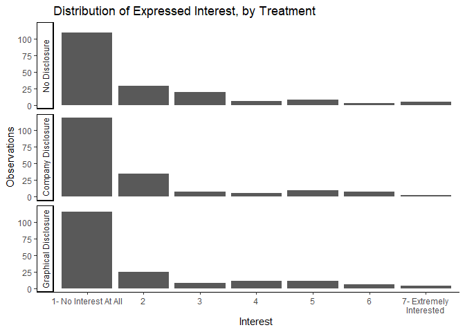<!-- -->

``` r
ggsave("graphs/h_interest.png",width=6,height=5)
```

We have two big takeaways here. First, most people report absolutely no
interest in wanting to know more about the MLM opportunity proposed to
them in this experiment. Second, the distribution of interest appears to
be mostly unchanged by either treatment.

## Estimated Earnings

Because estimated earnings are continuous rather than being in seven
bins like `interest`, the following graphs are box plots rather than
column histograms.

``` r
ggplot(mlm, aes(earnings)) +
  geom_boxplot() +
  facet_wrap(vars(treatment), ncol=1, strip.position = "left")+
  theme_classic()+
  theme(axis.ticks.y = element_blank(),
        axis.text.y = element_blank())+
  scale_x_continuous(labels = scales::comma)+
  xlab("Estimated Earnings ($)")+
  ylab("")+
  labs(title=paste("Distribution of Estimated Earnings in a Typical Year, by Treatment"))
```

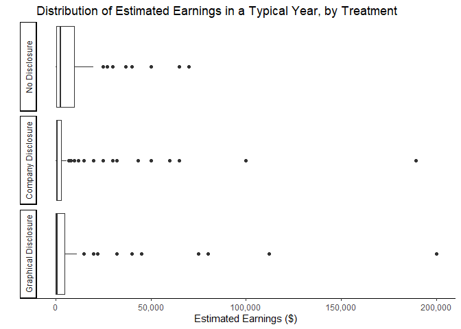<!-- -->

``` r
ggsave("graphs/b_earnings.png",width=6.5,height=5)
```

Two interesting, simultaneous effects can be observed in this graph.
First, it appears that both treatments lower the majority of estimated
earnings. This can be seen by the boxes in the bottom two panels being
compressed and closer to zero relative to the top panel. The second
effect is that some minority of respondents actually have significantly
higher estimates after observing either version of the MLM’s income
disclosure information. Those with higher estimates of earnings may be
subject to an anchoring effect of having seen some higher earnings
numbers in the disclosures than they would have imagined on their own.

``` r
ggplot(mlm %>% filter(earnmost<5000000)) +
  ### excludes one value: 10,000,000
  geom_boxplot(aes(x=earnmost)) +
  facet_wrap(vars(treatment), ncol=1, strip.position = "left")+
  theme_classic()+
  theme(axis.ticks.y = element_blank(),
        axis.text.y = element_blank())+
  scale_x_continuous(labels = scales::comma)+
  xlab("Estimated Earnings ($)")+
  ylab("")+
  labs(title=paste("Distribution of Estimated Most Earnings", "\n", 
                   "(one outlier removed: 10,000,000 in Company Disclosure)"))
```

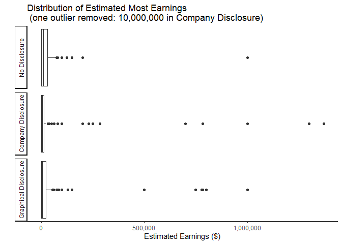<!-- -->

``` r
ggsave("graphs/b_maxearn.png",width=6.5,height=5)
```

The two competing effects observed in the estimated Typical Earnings are
more prominent when we look at the estimated Most Earnings. Again, the
boxes are more compressed with values closer to zero at the same time we
see a greater number of high-value outliers. This makes sense as
presumably the most a person could earn is more dependent on the maximum
earnings observed in an income disclosure. The marketing materials shown
to all subjects in this study included mentions of some distributors who
had earned more than $1 million. The Company Disclosure contains one
instance of a value over $1.3 million, but the highest number displayed
in the Graphical Disclosure is closer to $780,000. We can observe the
apparent anchoring effect of these values in the graph above.

``` r
ggplot(mlm %>% filter(earnleast<150000)) +
  ### excludes 1 values: 165,000
  geom_boxplot(aes(x=earnleast)) +
  facet_wrap(vars(treatment), ncol=1, strip.position = "left")+
  theme_classic()+
  theme(axis.ticks.y = element_blank(),
        axis.text.y = element_blank())+
  scale_x_continuous(labels = scales::comma)+
  xlab("Estimated Earnings ($)")+
  ylab("")+
  labs(title=paste("Distribution of Estimated Least Earnings", "\n", 
                   "(one outlier removed: 165,000 in Company Disclosure)"))
```

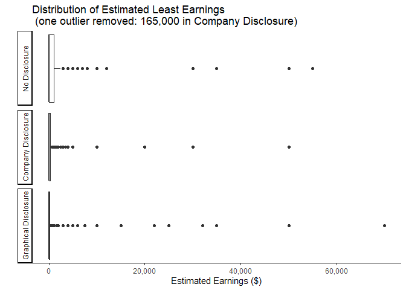<!-- -->

``` r
ggsave("graphs/b_minearn.png",width=6.5,height=5)
```

When we look at the distributions of expected Least Earnings, we still
observe the downward shift from the income disclosure treatment but
without the corresponding increase in outliers observed in the
distributions of Typical Earnings and Most Earnings. This again makes
sense if the increase in outliers is due to an anchoring effect of
observing specific values in the income disclosures. When considering
the least a person could earn, the value with the strongest anchoring
effect would be zero as that is the minimum that any person can earn.
This effect will only strengthen the downward pressure of treatment.

``` r
ggplot(mlm, aes(over6)) +
  geom_boxplot() +
  facet_wrap(vars(treatment), ncol=1, strip.position = "left")+
  theme_classic()+
  theme(axis.ticks.y = element_blank(),
        axis.text.y = element_blank())+
  xlab("Estimated Chance of Earning over $6,000 in a Typical Year")+
  ylab("")+
  labs(title = paste("Distribution of Estimated Chance of Earning over $6,000"))
```

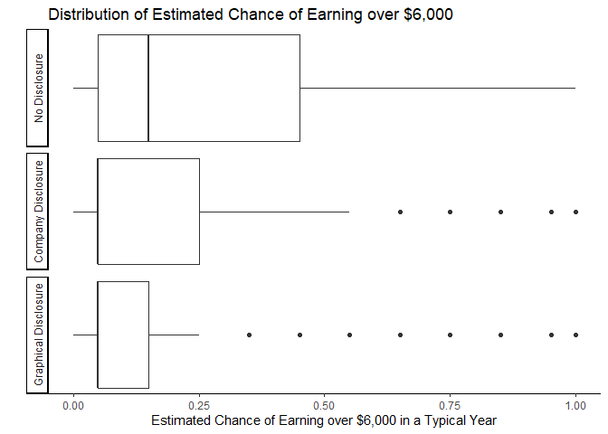<!-- -->

``` r
ggsave("graphs/b_over6.png",width=6.5,height=5)
```

The marketing materials also mentioned the possibility of $500 of
monthly income, which would equal $6,000 in a year. When we ask
respondents the likelihood of them earning more than this value, we
clearly observe another example of a negative pressure of income
disclosures on earnings estimates. As the value of this variable has a
maximum at 100 percent, we are unlikely to observe the same effect of a
few relatively high values like we see in the distributions of Most
Earnings or Typical Earnings. Additionally, neither income disclosure
provides any additional information about this likelihood and so is
unlikely to have any anchoring effects.

``` r
ggplot(mlm %>% filter(!is.na(expenses))) +
  geom_boxplot(aes(expenses)) +
  facet_wrap(vars(treatment), ncol=1, strip.position = "left")+
  theme_classic()+
  theme(axis.ticks.y = element_blank(),
        axis.text.y = element_blank())+
  scale_x_continuous(labels = scales::comma)+
  xlab("Estimated Expenses ($)")+
  ylab("")+
  labs(title="Distribution of Estimated Expenses")
```

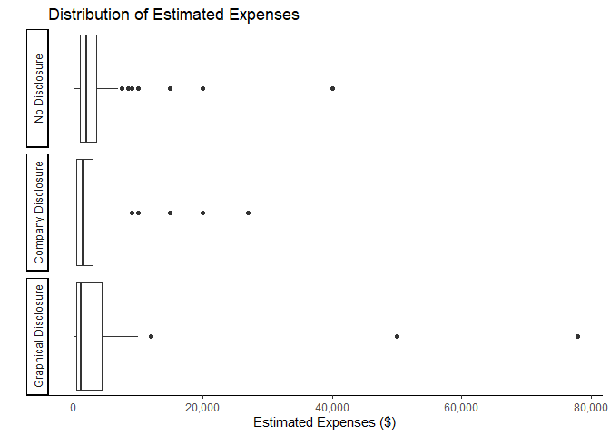<!-- -->

``` r
ggsave("graphs/b_expenses.png",width=6.5,height=5)
```

Finally, respondents in this experiment were never given any information
(either from the marketing materials or the income disclosure documents)
about potential expenses. It is not surprising, therefore, that we
observe no obvious pattern in the distributions of estimated expenses
across treatment groups.

It is also worth noting that respondents were not required to enter a
value for estimated expenses and many chose to leave this question
blank. For that reason, I filtered out all the observations with missing
values before generating the graph.

# Correlation of Interest v. Earnings

People may be interested in participating in an MLM opportunity for many
reasons (e.g., entrepreneurial orientation, reward responsiveness,
materialism, relationship to recruiter, or income needs). To the extent
that interest is tied to a desire to earn money, we may expect that
those with lower expected earnings will also have lower interest. This
is of particular concern for the analysis as it appears that the
interest of most people is not affected by the income disclosures. If
interest and expected earnings are highly correlated, it may be the case
that some of those who have lower estimated earnings due to being
presented with the income disclosure information will have lower
interest even if most people’s interest remains unaffected.

``` r
ggplot(mlm,aes(y=earnings,x=interestg))+
  geom_jitter()+
  geom_boxplot(outlier.shape = NA)+ 
  theme_classic()+
  scale_x_discrete(labels =c("7- Extremely Interested"="7- Extremely\nInterested"))+
  scale_y_continuous(labels = scales::comma)+
  xlab("Interest")+
  ylab("Estimated Earnings ($)")+
  labs(title="Estimated Earnings, by Interest")
```

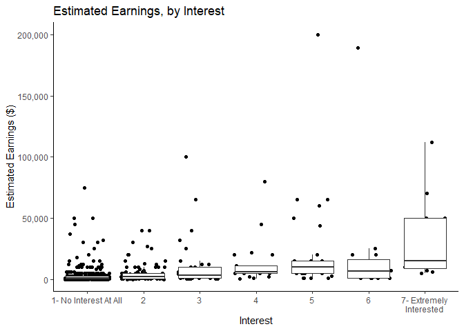<!-- -->

``` r
ggsave("graphs/InterestvEarnings.png",width=6,height=4.5)
```

It is obvious that most people have both low interest and low earnings
expectations. It does also seem that the distribution of expected
earnings trends upward as interest increases.

``` r
ggplot(mlm,aes(y=learnings,x=interestg))+
  geom_jitter()+
  geom_boxplot(outlier.shape = NA)+ 
  theme_classic()+
  scale_x_discrete(labels =c("7- Extremely Interested"="7- Extremely\nInterested"))+
  scale_y_continuous(labels = scales::comma)+
  xlab("Interest")+
  ylab("log(Estimated Earnings ($))")+
  labs(title="log(Estimated Earnings), by Interest")
```

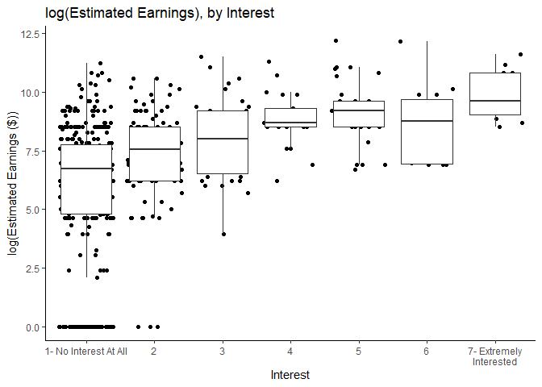<!-- -->

``` r
ggsave("graphs/interestvlearnings.png",width=6,height=4.5)
```

The pattern becomes more apparent when we look at the distribution of
the logarithm of estimated earnings by interest level.

# Better-than-average Effect

To test the hypothesis that some people respond to income disclosures
differently—specifically by focusing more on the higher values than on
the far-more-likely lower earnings reported—because they believe that
they are somehow more likely to earn more than most people, we include
in our analysis a measure of how each person believes their own personal
estimated earnings compare to those of the average participant.
Preliminary to including this variable in the analysis, we can observe
how this self-perception score correlates with both estimated earnings
and interest in the MLM opportunity.

``` r
ggplot(mlm,aes(y=earnings,x=as.factor(earnbta)))+
  geom_jitter()+
  geom_boxplot(outlier.shape = NA)+ 
  theme_classic()+
  scale_y_continuous(labels = scales::comma)+
  xlab("Expected Own Earnings Relative to Average Participant\n Note: 4 is \"I Think I Would Earn As Much As Average Participant\"")+
  ylab("Estimated Earnings ($)")+
  labs(title="Estimated Earnings v.\nEstimated Relation to Average Participant")
```

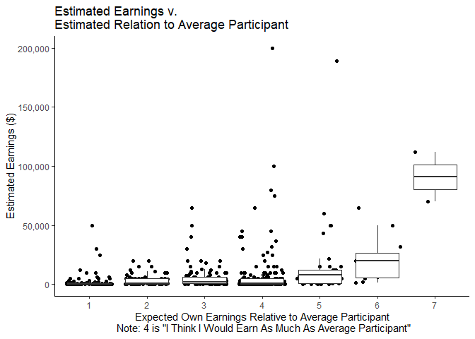<!-- -->

``` r
ggsave("graphs/BTAvEarnings.png",width=6,height=4.5)
```

As is consistent with tasks generally presumed to be more difficult or
complex, most people in this experiment report a comparison score of
less than 4 indicating that they believe that they would earn less than
the average participant. We also see that those who believe they will
make more than the average participant tend to have higher estimated
earnings, which makes sense.

``` r
ggplot(mlm %>% filter(earnmost<10000000), aes(y=earnmost,x=as.factor(earnbta)))+
     geom_jitter()+
     geom_boxplot(outlier.shape = NA)+ 
     theme_classic()+
     scale_y_continuous(labels = scales::comma)+
     xlab("Expected Own Earnings Relative to Average Participant\n Note: 4 is \"I Think I Would Earn As Much As Average Participant\"")+
     ylab("Estimated Earnings ($)")+
     labs(title=paste("Estimated Most Earnings v.\nEstimated Relation to Average Participant","\n",
                      "(one outlier removed: 10,000,000)"))
```

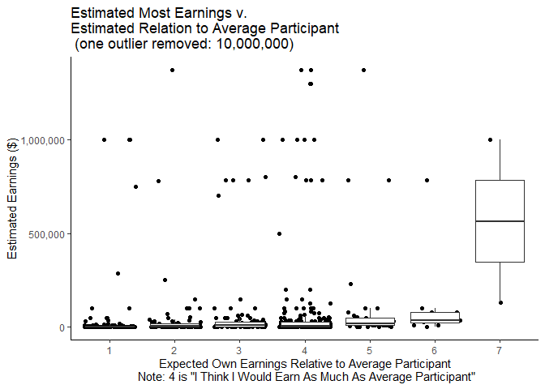<!-- -->

Interestingly, when we look at the distribution of expected Most
Earnings, it seems that some people of all comparison scores report
being able to earn nearly $1 million or more. This provides evidence not
only that are some people influenced by an anchoring effect due to
certain numbers appearing on income disclosures but also some people are
probably answering the question “What is the MOST you think you could
earn in a year?” in terms of the most possible that ANYONE is likely to
earn rather than maximum of what they reasonably believe they themselves
could earn.

``` r
ggplot(mlm,aes(y=interest,x=as.factor(earnbta)))+
  geom_jitter()+
  geom_boxplot(outlier.shape = NA)+ 
  theme_classic()+
  scale_y_continuous(breaks=c(1:7))+
  xlab("Expected Own Earnings Relative to Average Participant\n Note: 4 is \"I Think I Would Earn As Much As Average Participant\"")+
  ylab("Interest")+
  labs(title="Expressed Interest v.\nExpected Earnings Relative to Average Participant")
```

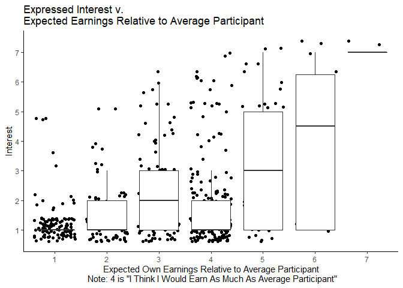<!-- -->

``` r
ggsave("graphs/BTAvInterest.png",width=6,height=4.5)
```

Finally, it is no surprise that those who believe they will earn more
than the average participant also tend to have more interest in the
opportunity.

[back to main](https://milleroztn.github.io/MLMExperiment/)
